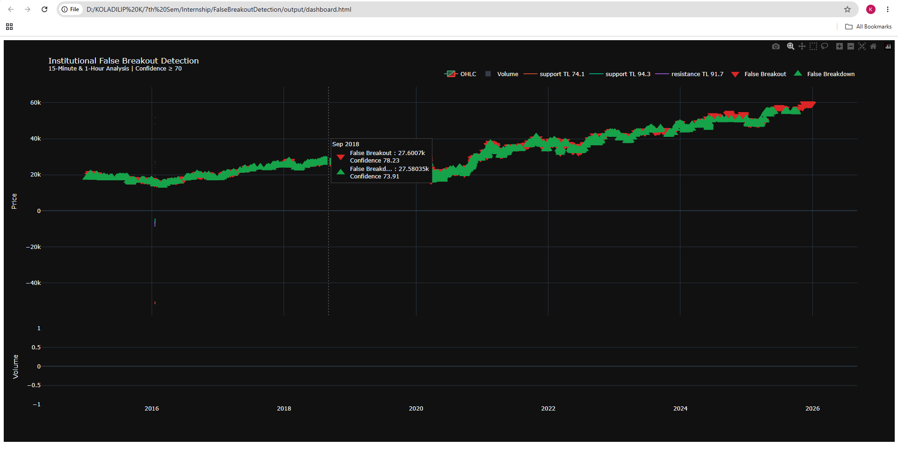

# False Breakout Detection

A production-quality Python 3.11 project for detecting support, resistance, trendlines, false breakouts, and false breakdowns from historical OHLCV market data.

## Problem Statement

The system consumes one-minute market data with `datetime`, `open`, `high`, `low`, `close`, `volume`, and `oi`. It cleans the data, builds 15-minute and 1-hour views, detects swing points, clusters support and resistance zones, scores confidence, confirms trendlines, detects failed moves beyond high-confidence levels, backtests the resulting signals, and exports CSV plus an interactive Plotly HTML dashboard.

## Architecture

- `config/`: YAML-driven configuration and typed settings classes.
- `src/core/`: data loading, resampling, swing detection, DBSCAN clustering, trendlines, confidence scoring, signal detection, validation, backtesting, and orchestration.
- `src/indicators/`: ATR, moving averages, volatility, and relative volume.
- `src/models/`: dataclasses for zones, trendlines, and signals.
- `src/visualization/`: Plotly dashboard and chart helpers.
- `tests/`: unit tests for cleaning, indicators, confidence, and signal logic.

## Algorithms

### Swing Detection

For each candle `i`, the system compares the candle high and low with a symmetric lookback window. A swing is accepted only when its prominence exceeds `threshold_i = ATR_i * atr_multiplier`.

### Support and Resistance Zones

Swing highs form resistance candidates and swing lows form support candidates. Each price set is clustered using DBSCAN with `eps = mean(ATR) * dbscan_eps_atr_multiplier`.

### Trendlines

The latest swing points are fit with ordinary least squares: `price = slope * bar_position + intercept`. Trendline confidence uses `R^2` and the number of touches.

### Confidence Score

Every zone receives a normalized 0-100 score: `score = 100 * sum(component_i * weight_i) / sum(weight_i)`. Components are touch count, relative volume, timeframe weight, trend strength, reversal strength, recency, and zone width.

### False Breakout Logic

A signal is emitted when price closes beyond a high-confidence zone, volume behavior indicates weakness or reversal, price returns inside the zone within N candles, and trendline confirmation agrees.

## How to Run

1. `cd FalseBreakoutDetection`
2. `python -m venv .venv`
3. `.venv\Scripts\activate`
4. `pip install -r requirements.txt`
5. `python main.py`

Outputs are written to `output/`: `dashboard.html`, `signals.csv`, `zones.csv`, `trades.csv`, `metrics.json`, and `pipeline.log`.

## Tests

Run `pytest` from the repository root.

## Dashboard

The dashboard contains candlesticks, support/resistance zones shaded by confidence, trendlines, volume, and markers for false breakouts and false breakdowns. Open `output/dashboard.html` after running the pipeline.

## Design Decisions

- ATR-adaptive thresholds make the detector robust across volatility regimes.
- DBSCAN avoids requiring a fixed number of support/resistance zones.
- Configuration is externalized so confidence weights and detection thresholds are auditable.
- Dataclasses keep domain objects explicit and easy to serialize.
- The backtester is deterministic and transparent for assignment review.

## Screenshots

# Dashboard Preview

The figure below shows the interactive Plotly dashboard generated by the system. It visualizes the candlestick chart, support and resistance zones, confidence levels, trendlines, and detected false breakout/breakdown signals.

  

# Methodology and Approach

## Understanding the Problem

The primary objective of this project is to develop a quantitative algorithm capable of identifying support, resistance, trendlines, and institutional false breakouts using only historical OHLCV market data. Rather than relying on subjective chart analysis, the solution focuses on designing a deterministic and explainable pipeline that can consistently identify market structure.

---

## Approach

The problem was divided into several independent modules so that each stage of the pipeline could be implemented, tested, and improved separately.

The overall workflow is:

1. Load and preprocess one-minute OHLCV data.
2. Resample the data into 15-minute and 1-hour timeframes.
3. Detect significant swing highs and swing lows.
4. Cluster nearby swing points into support and resistance zones.
5. Compute a quantitative confidence score for each zone.
6. Detect trendlines from significant swing points.
7. Identify false breakout and false breakdown events.
8. Evaluate detected signals and visualize the results.

This modular approach makes the system easier to understand, maintain, and extend.

---

## Methodology Selection

### Why Swing Highs and Swing Lows?

Support and resistance are formed where price repeatedly changes direction. Therefore, instead of analysing every candle, the algorithm first detects significant swing highs and swing lows to identify meaningful market turning points while reducing noise.

### Why DBSCAN?

Support and resistance are price zones rather than exact price levels. I considered clustering approaches and selected DBSCAN because it:

- Does not require the number of clusters beforehand.
- Handles noisy financial data effectively.
- Naturally groups nearby swing points into price zones.
- Treats isolated points as noise instead of forcing them into clusters.

### Why Multi-Timeframe Analysis?

Institutional traders often monitor multiple timeframes. Levels identified on the 1-hour timeframe generally carry more significance than those identified on the 15-minute timeframe. Therefore, the confidence scoring mechanism assigns greater importance to higher timeframe zones.

### Why a Confidence Score?

Not every support or resistance level is equally reliable. Instead of using fixed thresholds, the project assigns each zone a confidence score between 0 and 100 based on quantitative characteristics such as touch count, relative volume, timeframe importance, trend strength, reversal strength, recency, and zone width. This allows the algorithm to prioritize stronger market structures.

### Why Rule-Based False Breakout Detection?

The assignment specifically focuses on explainable market structure analysis. A rule-based approach provides transparency, making it easier to understand why a signal is generated and to validate each detection step.

---

## Limitations

This implementation is intended as a research prototype for quantitative market structure analysis. Although the pipeline detects support, resistance, trendlines, and false breakouts using historical data, the confidence scoring weights are heuristic and may benefit from further calibration using larger datasets and systematic backtesting.
## Future Improvements

- Add walk-forward parameter optimization.
- Add out-of-sample validation across multiple instruments.
- Include order book features if future data sources permit them.
- Add dashboard controls for timeframe and confidence filtering.
- Persist results in Parquet for faster iterative research.

## References

- J. Welles Wilder, New Concepts in Technical Trading Systems, ATR.
- Ester et al., A Density-Based Algorithm for Discovering Clusters in Large Spatial Databases with Noise, DBSCAN.
- Plotly Python documentation for interactive financial charts.
- scikit-learn DBSCAN documentation.
